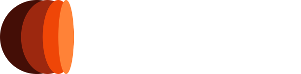

<p align="center">
  <a href="" rel="noopener">
    
  </a>
</p>

<div align="center">

[]()
[](/LICENSE)

</div>

---

<p align="center">
  <strong>Stockable</strong> is an investment analytics platform that provides daily stock recommendations based on analyst ratings.
    <br>
</p>

## 📝 Table of Contents

- [About](#about)
- [Getting Started](#getting_started)
- [Deployment](#deployment)
- [Usage](#usage)
- [Built Using](#built_using)
- [Authors](#authors)

## 🧐 About <a name = "about"></a>

**Stockable** is a comprehensive investment analytics tool designed to help investors make informed decisions. It aggregates analyst ratings, calculates key indicators, and provides actionable insights into the stock market. The platform includes:

- **Daily stock recommendations** based on market trends.
- **Visualization tools** for performance metrics.
- **Customizable filters** for user preferences.
- **Secure authentication** for user accounts.

## 🏁 Getting Started <a name = "getting_started"></a>

These instructions will help you set up the project on your local machine for development and testing.

### Prerequisites

Ensure you have the following installed:

- **Go** `1.23.3` or later
- **pnpm** `9.14.4` or later
- **CockroachDB** `24.3.6` (for local database testing)

Install CockroachDB locally:

```bash
# MacOS installation
brew install cockroachdb/tap/cockroach
```

For other platforms, check [CockroachDB Installation Guide](https://www.cockroachlabs.com/docs/v25.1/install-cockroachdb-mac.html).

### Installing

1. Clone the repository:
   ```bash
   git clone https://github.com/avi-2-avi/stockable.git
   cd stockable
   ```

2. **Backend Setup:**
   - Navigate to the backend directory:
     ```bash
     cd backend
     ```
   - Copy `.env.local.sample` as `.env` and configure the environments missing.
   - Run the data loader:
     ```bash
     go run cmd/loader/main.go
     ```
   - Start the backend server:
     ```bash
     go run cmd/server/main.go
     ```

3. **Frontend Setup:**
   - Navigate to the frontend directory:
     ```bash
     cd frontend
     ```
   - Copy `.env.local.sample` as `.env.local` and update API settings.
   - Install dependencies:
     ```bash
     pnpm install
     ```
   - Run the development server:
     ```bash
     pnpm dev
     ```

## 🔧 Running the Tests <a name = "tests"></a>

We provide unit tests for both backend and frontend components.

### Backend Tests
```bash
cd backend
# Run all backend tests
go test -v ./test/...
```

### Frontend Tests
```bash
cd frontend
# Run unit tests
pnpm test:unit
```

## 🎈 Usage <a name="usage"></a>

### Features
- **Landing Page**: Overview of the app and stock market insights.
- **Authentication**: Secure login and registration for users.
- **Dashboard**: Personalized stock recommendations and analysis.
- **Filtering & Sorting**: Customize recommendations based on various indicators.

## 🚀 Deployment <a name = "deployment"></a>

For Docker deployment:
```bash
docker-compose up --build
```

## ⛏️ Built Using <a name = "built_using"></a>

- [CockroachDB](https://www.cockroachlabs.com/) - Database
- [Vue.js](https://vuejs.org/) - Frontend Framework
- [Go](https://go.dev/) - Backend Language
- [Gin](https://gin-gonic.com/) - Web Framework for Go
- [Pinia](https://pinia.vuejs.org/) - State Management

## ✍️ Authors <a name = "authors"></a>

- [@avi-2-avi](https://github.com/avi-2-avi) - Cristina Vidal

## 📜 License

This project is licensed under the MIT License - see the [LICENSE](LICENSE) file for details.